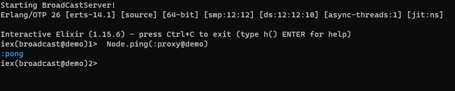
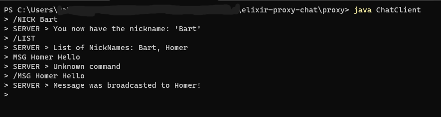

## Instructions for my Elixir Proxy Chat:

### Prerequisites:
Ensure that you have Java and Erlang/Elixir installed. You can download them using the following links: 
   * [Java for Windows](https://www.java.com/download/ie_manual.jsp)
   * [Java for Mac](https://www.java.com/en/download/apple.jsp)
   * [Elixir](https://elixir-lang.org/install.html)

### You can find my repository here: 
 [Elixir Proxy Chat Repository](https://github.com/daquioag/elixir-proxy-chat)

1. Open your terminal and navigate to a directory of your choice.
2. Clone the repository using the following command:
git pull https://github.com/daquioag/elixir-proxy-chat.git

3. To fully test this application, you will need four terminal tabs.
4. In the first tab, navigate to the 'Chat' directory and run the following command based on your operating system: 
* (windows) iex.bat --sname proxy -S mix 
* (mac) iex --sname proxy -S mix 

5. In the second tab, navigate to the 'Proxy' directory and run the following command based on your operating system: 
* (windows) iex.bat --sname broadcast -S mix 
* (mac) iex --sname broadcast -S mix 

Note: 'proxy' and 'broadcast' are just random names; you can set them to anything you prefer. 

You should see the Elixir interactive shell (iex) along with the hostname.
"iex(proxy@hostname)1>"
Reference Image:

6. To set up a connection between the two nodes, run the following command in the 'broadcast' tab:
Node.ping(:proxy@hostname)

If you receive the ':pong' response, that means you have successfully connected to the other node. ':pang' indicates that the connection was not established properly.
Reference Image:

7. Open two more tabs in your terminal and change the directory to to the 'Proxy' directoty.
8. Run the following command in both tabs to start Java Chat Clients:
* java ChatClient 

Reference Image:

You'll now see a '>' symbol, indicating that the Java client is running, and you can enter commands.

## Elixir Proxy Chat Commands:
This chat application supports four commands: /LIST, /NICK (nickname), /BC (message), and /MSG (nickname) (message). Commands are case-sensitive and must be terminated by an end-of-line character.

* /LIST: Lists users in the chat.
* /NICK (nickname): Sets your nickname. Nicknames must be unique, start with an alphabet character, and follow specific formatting rules.
    * nickname must start with an alphabet followed by characters that are either alphanumeric or the underscore character and it can have a maximum length of 12 characters
* /BC (message): Broadcasts a message to all users in the chat.
* /MSG (nickname) (message): Sends a private message to a specific user.

Setting a Nickname:
Use the /NICK command followed by your desired nickname.
Nicknames must be unique and adhere to the specified naming conventions: must start with an alphabet followed by characters that are either alphanumeric or the underscore character and it can have a maximum length of 12 characters
A successful response indicates that your nickname is set.

Sending Messages:
You can only send messages after setting a nickname.
Use /BC (message) to broadcast a message to all users.
Use /MSG (nickname) (message) to send a private message.
Remember to include both a nickname and message content for private messages.
Important Notes:

Avoid using /NICK or /BC without additional arguments as these are considered invalid.
The /LIST command works without setting a nickname.
Make sure your nickname follows the naming rules for successful nickname setting.

Some reference images for an example conversaion between 2 clients. 

