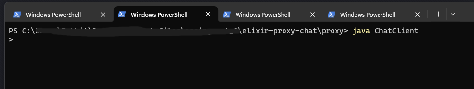

## Instructions for my Elixir Proxy Chat:

### Prerequisites:
Ensure that you have Java and Erlang/Elixir installed. You can download them using the following links: 
   * [Java for Windows](https://www.java.com/download/ie_manual.jsp)
   * [Java for Mac](https://www.java.com/en/download/apple.jsp)
   * [Elixir](https://elixir-lang.org/install.html)

### You can find my repository here: 
 [Elixir Proxy Chat Repository](https://github.com/daquioag/elixir-proxy-chat)

1. Open your terminal and navigate to a directory of your choice.
2. Clone the repository using the following command:
git pull https://github.com/daquioag/elixir-proxy-chat.git

Alternatively, you can download the ZIP folder from the following location: [Elixir Proxy Chat ZIP Folder](https://github.com/daquioag/elixir-proxy-chat/blob/main/elixir-proxy-chat.zip)

3. To fully test this application, you will need three terminal tabs.
4. In the first tab, navigate to the 'Chat' directory and run the following command based on 
* (windows) iex.bat -S mix 
* (mac) iex -S mix 

You should see the Elixir interactive shell (iex).
Reference Image:

5. Open two more tabs in your terminal and change the directory to 'elixir-proxy-chat'.
6. Run the following command in both tabs to start Java Chat Clients:

* java ChatClient 

Reference Image:

You'll now see a '>' symbol, indicating that the Java client is running, and you can enter commands.

## Elixir Proxy Chat Commands:
This chat application supports four commands: /LIST, /NICK (nickname), /BC (message), and /MSG (nickname) (message). Commands are case-sensitive and must be terminated by an end-of-line character.

* /LIST: Lists users in the chat.
* /NICK (nickname): Sets your nickname. Nicknames must be unique, start with an alphabet character, and follow specific formatting rules.
* /BC (message): Broadcasts a message to all users in the chat.
* /MSG (nickname) (message): Sends a private message to a specific user.

Setting a Nickname:
Use the /NICK command followed by your desired nickname.
Nicknames must be unique and adhere to the specified naming conventions.
A successful response indicates that your nickname is set.

Sending Messages:
You can only send messages after setting a nickname.
Use /BC (message) to broadcast a message to all users.
Use /MSG (nickname) (message) to send a private message.
Remember to include both a nickname and message content for private messages.
Important Notes:

Avoid using /NICK or /BC without additional arguments as these are considered invalid.
The /LIST command works without setting a nickname.
Make sure your nickname follows the naming rules for successful nickname setting.

